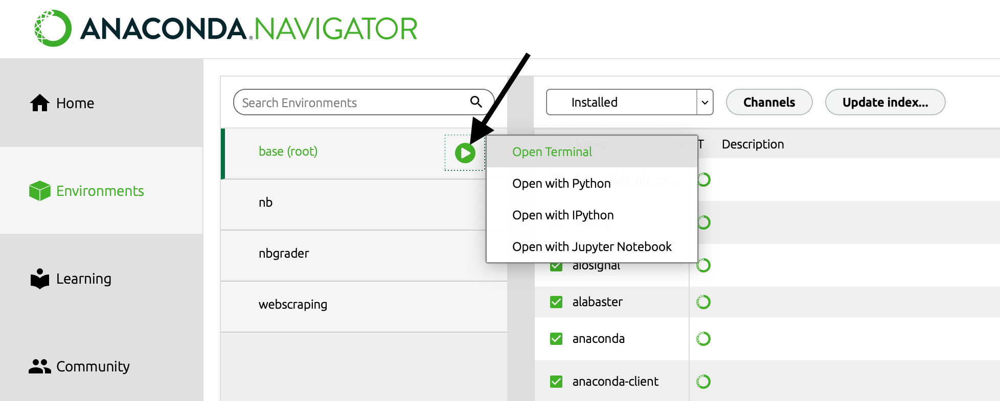

# Programming toolkit

This section contains an overview about the programming toolkit you will need for our course. 

You will need to install:

1. the latest version of [Anaconda](anaconda) (includes Python and some toolkits) 
2. [Visual Studio Code](vscode) (a code editor)
3. [Git and create an acount at GitHub](github) (for software development and version control)

Please read the following instructions.

---

(anaconda)=
## Anaconda

The open-source [Anaconda Individual Edition](https://www.anaconda.com/products/individual) is one of the easiest ways to get started with data science projects. It already includes Python and the most important data science modules. 

:::{note}
Anaconda is a data science toolkit which already includes most of the data science modules we need.
:::


### Uninstall your old version

To avoid compatibility problems with older versions of Anaconda, I recommend to uninstall Anaconda and install the latest version.

#### Windows

1. Open the file explorer.
1. Delete your environment (anaconda3\envs) and package (anaconda3\pkgs) folders in your user folder.
1. Open Add or remove programs and uninstall your Anaconda installation.

To learn more about how to uninstall Anaconda, take a look at [this page](https://docs.anaconda.com/anaconda/install/uninstall/).

#### macOS

1. [Open your terminal](https://support.apple.com/guide/terminal/open-or-quit-terminal-apd5265185d-f365-44cb-8b09-71a064a42125/mac) 
1. Remove your entire Anaconda directory with `rm -rf`. Depending on your installation, your anaconda3 directory will be in your root folder or in your opt folder. If you are not sure where anaconda is installed, simply enter all commands. Note that there will be no information printed in the terminal - it will just remove Anaconda. 

First try the opt folder:

```bash
rm -rf ~/opt/anaconda3
```
Then this location:

```bash
rm -rf anaconda3
```

Finally, enter:

```bash
rm -rf ~/anaconda3
```

To learn more about how to uninstall Anaconda, take a look at [this page](https://docs.anaconda.com/anaconda/install/uninstall/).


### Installation

Install the latest version of the Anaconda Individual Edition:

```{admonition} To do
:class: tip

- [💾 Anaconda installation](https://www.anaconda.com/products/individual)

```


<!--
After you have installed Anaconda, open the "Anaconda Navigator" program (if you see a pop-up with information about a new version of the Navigator, don't update it now):

1. Click on the tab `Environments` at the left of the menu
2. Select the green button next to the `base (root)` environment
3. Choose `Open Terminal`




-->


### Use conda-forge

Instead of the conda default package manager, we want to use the community-led alternative `conda-forge` to install Python modules.


> On *Windows* open the Start menu and open the "Anaconda Command Prompt". 


> On *macOS*: [Open a terminal](https://support.apple.com/guide/terminal/open-or-quit-terminal-apd5265185d-f365-44cb-8b09-71a064a42125/mac) 


Type this in your terminal to add `conda-forge`:

```bash
conda config --add channels conda-forge
```

Then make `conda-forge` the priority channel: 

```bash
conda config --set channel_priority strict
```


---

(vscode)=
## Visual Studio Code 


Visual Studio Code (also called Code) is a powerful source code editor which runs on your desktop and is available for Windows, macOS and Linux. It comes with a rich ecosystem of extensions for Python.

:::{note}
Visual Studio Code is a code editor that can be used with a variety of programming languages including Python.
:::

<br>

<iframe width="560" height="315" src="https://www.youtube-nocookie.com/embed/KMxo3T_MTvY" title="YouTube video player" frameborder="0" allow="accelerometer; autoplay; clipboard-write; encrypted-media; gyroscope; picture-in-picture" allowfullscreen></iframe>

<br>

### Installation

Install VS Code:

```{admonition} To do
:class: tip
- 💾 Install [VS Code](https://code.visualstudio.com/)
```

### Install extensions

The features that Visual Studio Code includes out-of-the-box are just the start. VS Code extensions let you add languages, debuggers, and tools to your installation to support your development workflow.

Let's install some extensions:

```{admonition} To do
:class: tip

- 💾 Install the [Python extension](https://marketplace.visualstudio.com/items?itemName=ms-python.python)

- 💾 Install the [Live Share Extension Pack](https://marketplace.visualstudio.com/items?itemName=MS-vsliveshare.vsliveshare-pack)
```

Now close and restart VS Code.

### Jupyter Notebook extension

We usually work with Jupyter Notebook files in VS Code. 

```{admonition} To do
:class: tip

- 💾 Install the [Jupyter extension](https://marketplace.visualstudio.com/items?itemName=ms-toolsai.jupyter)

```

Now close and restart VS Code.

Open a Juptyer Notebook in VS Code:

```{admonition} To do
:class: tip
- Learn how to use [Jupyter Notebooks in VS Code](https://code.visualstudio.com/docs/datascience/jupyter-notebooks)
```

If you can't select a kernel (like the so called `base` kernel), try to close and restart VS Code once again.


(github)=
## Git and GitHub

Git is a version control system -- like the “Track Changes” features from Microsoft Word with many more additional features.

[GitHub](https://github.com/) is a provider of internet hosting for software development and version control using Git. 

:::{note}
We will use GitHub as a platform for web hosting and collaboration.
:::

- Git can be used to store content 
- Code can be changed and other developers can add code in parallel.
- Git has a remote repository which is stored in a server and a local repository which is stored in the computer of each developer.  

<br>

<iframe width="560" height="315" src="https://www.youtube.com/embed/w3jLJU7DT5E" title="YouTube video player" frameborder="0" allow="accelerometer; autoplay; clipboard-write; encrypted-media; gyroscope; picture-in-picture" allowfullscreen></iframe>  

<br>

<br>

> On *Windows* open the Start menu and open the "Anaconda Command Prompt". 


> On *macOS*: [Open a terminal](https://support.apple.com/guide/terminal/open-or-quit-terminal-apd5265185d-f365-44cb-8b09-71a064a42125/mac) 


```bash
git --version
```

If you don't see the version, you need to install Git. 

*If you have **macOS**, the terminal may ask you if you want to install Git. Use this option to install Git right away*.  

```{admonition} To do
:class: tip


- 💾 Mac: 
  - Option 1: Install Git from your terminal after you have typed `git --version` in your terminal
  - Option 2: Install Apple's [XCode](https://apps.apple.com/us/app/xcode/id497799835?mt=12), which includes Git. 
  - Option 3: Install [Git with the help of homebrew](https://git-scm.com/download/mac).


- 💾 Windows: [Download Git](https://git-scm.com/download/win). You can follow [these instructions](https://www.heise.de/tipps-tricks/Git-auf-Windows-installieren-und-einrichten-5046134.html) to learn which options to choose during the installation process. When you are asked which editor you want to use, choose Visual Stuido Code)


```


You also need a free GitHub-account for our course. Please follow the instructions below (*in case you already have a GitHub account: please add your HdM-email address to your account*):

```{admonition} To do
:class: tip

- [Create a free GitHub account with your HdM-email](https://github.com/join)
- Verify your GitHub email
- 💾 Install the [VS Code GitHub extension](https://code.visualstudio.com/docs/editor/github)
- 💾 Install [GitHub Desktop](https://desktop.github.com/) to synchronize your machine with GitHub
```

Next, we proceed in Moodle:

```{admonition} To do
:class: tip

1. go to our Moodle course
2. locate the section "Assignments" -> "Application Exercises"
3. Open the page "Accept invitation to application exercises (AE)" 
4. Accept the first application exercise.
5. On the following page, you need to select your HdM id to get membership in our GitHub Classroom course

```

Before you install the next extension, make sure you have the following prerequisites:

- An active GitHub account
- Membership in our GitHub Classroom course
- Git installed on your computer

```{admonition} To do
:class: tip

- 💾 Install the [VS Code GitHub Classroom extension](https://marketplace.visualstudio.com/items?itemName=GitHub.classroom&ssr=false#overview)

```


---

